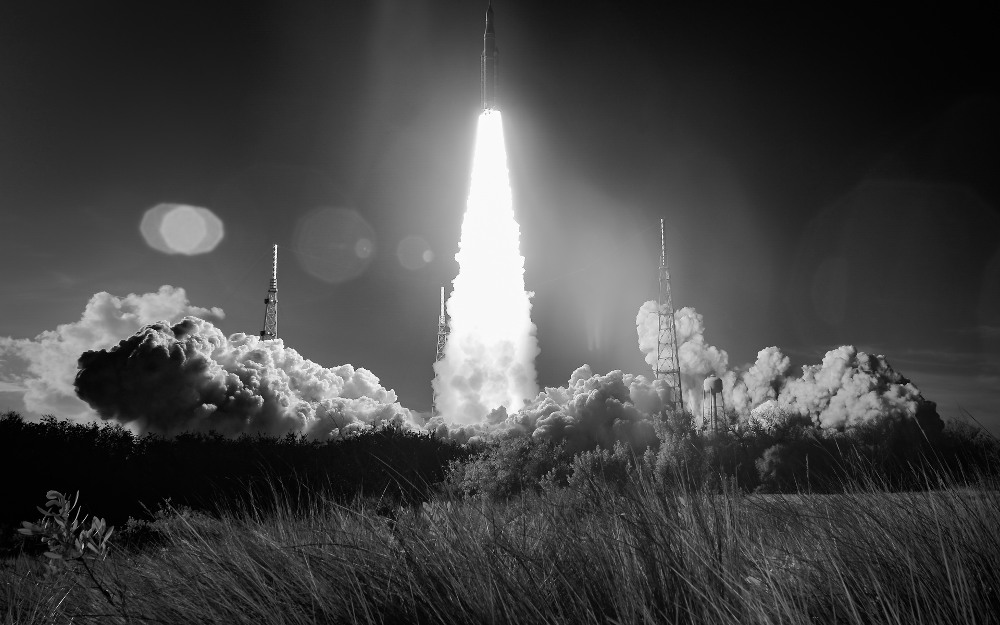

# Artemis II Wallpapers

</img>

This was a quick and dirty project to make the Artemis II images available in common resolutions. 

You can download zip files of all the images either in the releases tab on the right or by going into the releases folder above.

I picked the images I personally liked to include, let me know if you want me to add any by opening a github issue.
Some of the higher resolutions might look a little wonky or have bad cropping. I didn't have enough time to go through them all, sorry.

Mobile is a WIP, if there's any interest in this I'll go through and make some available.

## Images Sourcing

All images were sourced from the <a href="https://images.nasa.gov/">NASA image library</a>. 

NASA's Usage guidelines can be <a href="https://www.nasa.gov/nasa-brand-center/">found here</a>

